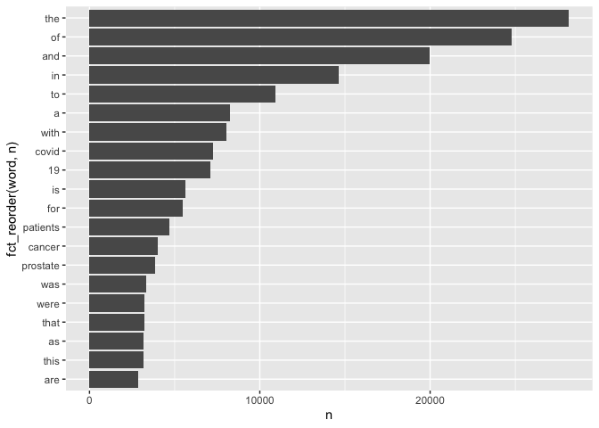

Homework 3
================
Lily
2022-11-05

``` r
knitr::opts_chunk$set(echo = TRUE)
```

``` r
library(tidytext)
library(tidyverse)
```

    ## ── Attaching packages ─────────────────────────────────────── tidyverse 1.3.2 ──
    ## ✔ ggplot2 3.3.6     ✔ purrr   0.3.4
    ## ✔ tibble  3.1.8     ✔ dplyr   1.0.9
    ## ✔ tidyr   1.2.0     ✔ stringr 1.4.1
    ## ✔ readr   2.1.3     ✔ forcats 0.5.2
    ## ── Conflicts ────────────────────────────────────────── tidyverse_conflicts() ──
    ## ✖ dplyr::filter() masks stats::filter()
    ## ✖ dplyr::lag()    masks stats::lag()

``` r
library(dplyr)
library(ggplot2)
library(forcats)
library(stringr)
library(rvest)
```

    ## 
    ## Attaching package: 'rvest'
    ## 
    ## The following object is masked from 'package:readr':
    ## 
    ##     guess_encoding

# Question 1: How many papers were you able to find?

``` r
website <- xml2::read_html("https://pubmed.ncbi.nlm.nih.gov/?term=Sars-cov-2+trial+vaccine")
counts <- xml2::xml_find_first(website, "/html/body/main/div[9]/div[2]/div[2]/div[1]/div[1]")
counts <- as.character(counts)
stringr::str_extract(counts, "[0-9,]+")
```

    ## [1] "4,009"

# Question 2: Download each papers’ details using the query parameter rettype = abstract.

``` r
library(httr)
query_ids <- GET(
  url   = "https://eutils.ncbi.nlm.nih.gov/entrez/eutils/esearch.fcgi",
  query = list(
    db      = "pubmed",
    term    = "sars-cov-2 trial vaccine",
    retmax  = 250
  ), 
)
ids <- httr::content(query_ids)
```

# Question 3

``` r
ids <- as.character(ids)
ids <- stringr::str_extract_all(ids, "<Id>[[:digit:]]+</Id>")[[1]]
ids <- stringr::str_remove_all(ids, "</?Id>")
head(ids)
```

    ## [1] "36328879" "36328399" "36327352" "36322837" "36320825" "36314847"

``` r
publications <- GET(
  url   = "https://eutils.ncbi.nlm.nih.gov/entrez/eutils/efetch.fcgi",
  query = list(
    db  = "pubmed",
    id  = paste(ids,collapse = ","),
  retmax = 250,
  rettype = "abstract"
    )
)
publications <- httr::content(publications)
```

### Part 1: Pubmed ID number

``` r
pub_char_list <- xml2::xml_children(publications)
pub_char_list <- sapply(pub_char_list, as.character)
```

### Part 2: Title of the paper

``` r
titles <- str_extract(pub_char_list, "<ArticleTitle>[[:print:][:space:]]+</ArticleTitle>")
titles[[1]]
```

    ## [1] "<ArticleTitle>Safety, tolerability and immunogenicity of Biological E's CORBEVAX™ vaccine in children and adolescents: A prospective, randomised, double-blind, placebo controlled, phase-2/3 study.</ArticleTitle>"

``` r
titles <- str_remove_all(titles, "</?[[:alnum:]- =\"]+>")
titles[[1]]
```

    ## [1] "Safety, tolerability and immunogenicity of Biological E's CORBEVAX™ vaccine in children and adolescents: A prospective, randomised, double-blind, placebo controlled, phase-2/3 study."

### Part 3: Name of the journal where it was published

``` r
JName <- str_extract(pub_char_list, "<Title>[[:print:][:space:]]+</Title>")
JName[[1]]
```

    ## [1] "<Title>Vaccine</Title>"

``` r
JName <- str_remove_all(JName, "</?[[:alnum:]- =\"]+>") 
JName[[1]]
```

    ## [1] "Vaccine"

``` r
JName <- str_replace_all(JName, "[[:space:]]+"," ")
JName[[1]]
```

    ## [1] "Vaccine"

### Part 4: Publication date

``` r
PDate <- str_extract(pub_char_list, "<PDate>[[:print:][:space:]]+</PDate>")
PDate[[1]]
```

    ## [1] NA

``` r
PDate <- str_remove_all(PDate, "</?[[:alnum:]- =\"]+>") 
PDate[[1]]
```

    ## [1] NA

``` r
PDate <- str_replace_all(PDate, "[[:space:]]+"," ")
PDate[[1]]
```

    ## [1] NA

### Part 4:Abstract of the paper (if any)

``` r
abstracts <- str_extract(pub_char_list, "<Abstract>[[:print:][:space:]]+</Abstract>")
abstracts[[1]]
```

    ## [1] "<Abstract>\n        <AbstractText Label=\"BACKGROUND\" NlmCategory=\"BACKGROUND\">After establishing safety and immunogenicity of Biological-E's CORBEVAX™ vaccine in adult population (18-80 years) in Phase 1-3 studies, vaccine is further tested in children and adolescents in this study.</AbstractText>\n        <AbstractText Label=\"METHODS\" NlmCategory=\"METHODS\">This is a phase-2/3 prospective, randomised, double-blind, placebo-controlled study evaluating safety, reactogenicity, tolerability and immunogenicity of CORBEVAX™ vaccine in children and adolescents of either gender between &lt;18 to ≥12 years of age in Phase-2 and &lt;18 to ≥5 years of age in Phase-Phase-2/Phase-3 with placebo as a control. This study has two age sub-groups; subgroup-1 with subjects &lt;18 to ≥12 years of age and subgroup-2 with subjects &lt;12 to ≥5 years of age. In both sub groups, eligible subjects (SARS-CoV-2 RT-PCR negative and seronegative at baseline) were randomized to receive either CORBEVAX™ vaccine or Placebo in 3:1 ratio.</AbstractText>\n        <AbstractText Label=\"FINDINGS\" NlmCategory=\"RESULTS\">The safety profile of CORBEVAX™ vaccine in both pediatric cohorts was comparable to the placebo-control group. Majority of reported adverse events (AEs) were mild in nature. No severe or serious-AEs, medically attended AEs (MAAEs) or AEs of special interest (AESI) were reported during the study period and all reported AEs resolved without any sequelae. In both pediatric age groups, CORBEVAX™ vaccinated subjects showed significant improvement in humoral immune-responses in terms of anti-RBD-IgG concentrations, anti-RBD-IgG1 titers, neutralizing-antibody (nAb)-titers against Ancestral-Wuhan and Delta-strains. Significantly high interferon-gamma immune- response (cellular) was elicited by CORBEVAX™ vaccinated subjects with minimal effect on IL-4 cytokine secretion.</AbstractText>\n        <AbstractText Label=\"INTERPRETATIONS\" NlmCategory=\"CONCLUSIONS\">The safety profile of CORBEVAX™ vaccine in &lt;18 to ≥5 years' children and adolescents was found to be safe and tolerable. Significant increase in anti-RBD-IgG and nAb-titers and IFN-gamma immune-responses were observed post-vaccination in both pediatric age sub-groups. The nAb titers observed in both the pediatric age cohorts were non-inferior to the adult cohort (BECT069 study) in terms of ratio of the GMT's of both the cohorts. This study shows that CORBEVAX™ vaccine is highly immunogenic and can be safely administered to pediatric population as young as 5 years old. The study was prospectively registered with clinical trial registry of India- CTRI/2021/10/037066.</AbstractText>\n        <CopyrightInformation>Copyright © 2022 Elsevier Ltd. All rights reserved.</CopyrightInformation>\n      </Abstract>"

``` r
abstracts <- str_remove_all(abstracts, "</?[[:alnum:]- =\"]+>") 
abstracts[[1]]
```

    ## [1] "\n        After establishing safety and immunogenicity of Biological-E's CORBEVAX™ vaccine in adult population (18-80 years) in Phase 1-3 studies, vaccine is further tested in children and adolescents in this study.\n        This is a phase-2/3 prospective, randomised, double-blind, placebo-controlled study evaluating safety, reactogenicity, tolerability and immunogenicity of CORBEVAX™ vaccine in children and adolescents of either gender between &lt;18 to ≥12 years of age in Phase-2 and &lt;18 to ≥5 years of age in Phase-Phase-2/Phase-3 with placebo as a control. This study has two age sub-groups; subgroup-1 with subjects &lt;18 to ≥12 years of age and subgroup-2 with subjects &lt;12 to ≥5 years of age. In both sub groups, eligible subjects (SARS-CoV-2 RT-PCR negative and seronegative at baseline) were randomized to receive either CORBEVAX™ vaccine or Placebo in 3:1 ratio.\n        The safety profile of CORBEVAX™ vaccine in both pediatric cohorts was comparable to the placebo-control group. Majority of reported adverse events (AEs) were mild in nature. No severe or serious-AEs, medically attended AEs (MAAEs) or AEs of special interest (AESI) were reported during the study period and all reported AEs resolved without any sequelae. In both pediatric age groups, CORBEVAX™ vaccinated subjects showed significant improvement in humoral immune-responses in terms of anti-RBD-IgG concentrations, anti-RBD-IgG1 titers, neutralizing-antibody (nAb)-titers against Ancestral-Wuhan and Delta-strains. Significantly high interferon-gamma immune- response (cellular) was elicited by CORBEVAX™ vaccinated subjects with minimal effect on IL-4 cytokine secretion.\n        The safety profile of CORBEVAX™ vaccine in &lt;18 to ≥5 years' children and adolescents was found to be safe and tolerable. Significant increase in anti-RBD-IgG and nAb-titers and IFN-gamma immune-responses were observed post-vaccination in both pediatric age sub-groups. The nAb titers observed in both the pediatric age cohorts were non-inferior to the adult cohort (BECT069 study) in terms of ratio of the GMT's of both the cohorts. This study shows that CORBEVAX™ vaccine is highly immunogenic and can be safely administered to pediatric population as young as 5 years old. The study was prospectively registered with clinical trial registry of India- CTRI/2021/10/037066.\n        Copyright © 2022 Elsevier Ltd. All rights reserved.\n      "

``` r
abstracts <- str_replace_all(abstracts, "[[:space:]]+"," ")
abstracts[[1]]
```

    ## [1] " After establishing safety and immunogenicity of Biological-E's CORBEVAX™ vaccine in adult population (18-80 years) in Phase 1-3 studies, vaccine is further tested in children and adolescents in this study. This is a phase-2/3 prospective, randomised, double-blind, placebo-controlled study evaluating safety, reactogenicity, tolerability and immunogenicity of CORBEVAX™ vaccine in children and adolescents of either gender between &lt;18 to ≥12 years of age in Phase-2 and &lt;18 to ≥5 years of age in Phase-Phase-2/Phase-3 with placebo as a control. This study has two age sub-groups; subgroup-1 with subjects &lt;18 to ≥12 years of age and subgroup-2 with subjects &lt;12 to ≥5 years of age. In both sub groups, eligible subjects (SARS-CoV-2 RT-PCR negative and seronegative at baseline) were randomized to receive either CORBEVAX™ vaccine or Placebo in 3:1 ratio. The safety profile of CORBEVAX™ vaccine in both pediatric cohorts was comparable to the placebo-control group. Majority of reported adverse events (AEs) were mild in nature. No severe or serious-AEs, medically attended AEs (MAAEs) or AEs of special interest (AESI) were reported during the study period and all reported AEs resolved without any sequelae. In both pediatric age groups, CORBEVAX™ vaccinated subjects showed significant improvement in humoral immune-responses in terms of anti-RBD-IgG concentrations, anti-RBD-IgG1 titers, neutralizing-antibody (nAb)-titers against Ancestral-Wuhan and Delta-strains. Significantly high interferon-gamma immune- response (cellular) was elicited by CORBEVAX™ vaccinated subjects with minimal effect on IL-4 cytokine secretion. The safety profile of CORBEVAX™ vaccine in &lt;18 to ≥5 years' children and adolescents was found to be safe and tolerable. Significant increase in anti-RBD-IgG and nAb-titers and IFN-gamma immune-responses were observed post-vaccination in both pediatric age sub-groups. The nAb titers observed in both the pediatric age cohorts were non-inferior to the adult cohort (BECT069 study) in terms of ratio of the GMT's of both the cohorts. This study shows that CORBEVAX™ vaccine is highly immunogenic and can be safely administered to pediatric population as young as 5 years old. The study was prospectively registered with clinical trial registry of India- CTRI/2021/10/037066. Copyright © 2022 Elsevier Ltd. All rights reserved. "

### Dataset

``` r
database <- data.frame(
  PubMedId = ids,
  Title    = titles,
  PDate=PDate,
  Abstract = abstracts,
  journal=JName
)
knitr::kable(head(database[,1:5]), caption = "Sars-cov-2 trial vaccine")
```

| PubMedId | Title                                                                                                                                                                                                                 | PDate | Abstract                                                                                                                                                                                                                                                                                                                                                                                                                                                                                                                                                                                                                                                                                                                                                                                                                                                                                                                                                                                                                                                                                                                                                                                                                                                                                                                                                                                                                                                                                                                                                                                                                                                                                                                                                                                                                                                                                                                                                                                                                                                                                                                                                                                                                                                                                                                                                                                                                                                                                                                                                                                                                                                                                                                                                                                                                                                                                                                                                                                                                                                                                                                                                                                                                                                                                                                                                                                                                                                                                                                                                                                                                                                                                                                                                                           | journal                             |
|:---------|:----------------------------------------------------------------------------------------------------------------------------------------------------------------------------------------------------------------------|:------|:-----------------------------------------------------------------------------------------------------------------------------------------------------------------------------------------------------------------------------------------------------------------------------------------------------------------------------------------------------------------------------------------------------------------------------------------------------------------------------------------------------------------------------------------------------------------------------------------------------------------------------------------------------------------------------------------------------------------------------------------------------------------------------------------------------------------------------------------------------------------------------------------------------------------------------------------------------------------------------------------------------------------------------------------------------------------------------------------------------------------------------------------------------------------------------------------------------------------------------------------------------------------------------------------------------------------------------------------------------------------------------------------------------------------------------------------------------------------------------------------------------------------------------------------------------------------------------------------------------------------------------------------------------------------------------------------------------------------------------------------------------------------------------------------------------------------------------------------------------------------------------------------------------------------------------------------------------------------------------------------------------------------------------------------------------------------------------------------------------------------------------------------------------------------------------------------------------------------------------------------------------------------------------------------------------------------------------------------------------------------------------------------------------------------------------------------------------------------------------------------------------------------------------------------------------------------------------------------------------------------------------------------------------------------------------------------------------------------------------------------------------------------------------------------------------------------------------------------------------------------------------------------------------------------------------------------------------------------------------------------------------------------------------------------------------------------------------------------------------------------------------------------------------------------------------------------------------------------------------------------------------------------------------------------------------------------------------------------------------------------------------------------------------------------------------------------------------------------------------------------------------------------------------------------------------------------------------------------------------------------------------------------------------------------------------------------------------------------------------------------------------------------------------------|:------------------------------------|
| 36328879 | Safety, tolerability and immunogenicity of Biological E’s CORBEVAX™ vaccine in children and adolescents: A prospective, randomised, double-blind, placebo controlled, phase-2/3 study.                                | NA    | After establishing safety and immunogenicity of Biological-E’s CORBEVAX™ vaccine in adult population (18-80 years) in Phase 1-3 studies, vaccine is further tested in children and adolescents in this study. This is a phase-2/3 prospective, randomised, double-blind, placebo-controlled study evaluating safety, reactogenicity, tolerability and immunogenicity of CORBEVAX™ vaccine in children and adolescents of either gender between \<18 to ≥12 years of age in Phase-2 and \<18 to ≥5 years of age in Phase-Phase-2/Phase-3 with placebo as a control. This study has two age sub-groups; subgroup-1 with subjects \<18 to ≥12 years of age and subgroup-2 with subjects \<12 to ≥5 years of age. In both sub groups, eligible subjects (SARS-CoV-2 RT-PCR negative and seronegative at baseline) were randomized to receive either CORBEVAX™ vaccine or Placebo in 3:1 ratio. The safety profile of CORBEVAX™ vaccine in both pediatric cohorts was comparable to the placebo-control group. Majority of reported adverse events (AEs) were mild in nature. No severe or serious-AEs, medically attended AEs (MAAEs) or AEs of special interest (AESI) were reported during the study period and all reported AEs resolved without any sequelae. In both pediatric age groups, CORBEVAX™ vaccinated subjects showed significant improvement in humoral immune-responses in terms of anti-RBD-IgG concentrations, anti-RBD-IgG1 titers, neutralizing-antibody (nAb)-titers against Ancestral-Wuhan and Delta-strains. Significantly high interferon-gamma immune- response (cellular) was elicited by CORBEVAX™ vaccinated subjects with minimal effect on IL-4 cytokine secretion. The safety profile of CORBEVAX™ vaccine in \<18 to ≥5 years’ children and adolescents was found to be safe and tolerable. Significant increase in anti-RBD-IgG and nAb-titers and IFN-gamma immune-responses were observed post-vaccination in both pediatric age sub-groups. The nAb titers observed in both the pediatric age cohorts were non-inferior to the adult cohort (BECT069 study) in terms of ratio of the GMT’s of both the cohorts. This study shows that CORBEVAX™ vaccine is highly immunogenic and can be safely administered to pediatric population as young as 5 years old. The study was prospectively registered with clinical trial registry of India- CTRI/2021/10/037066. Copyright © 2022 Elsevier Ltd. All rights reserved.                                                                                                                                                                                                                                                                                                                                                                                                                                                                                                                                                                                                                                                                                                                                                                                                                                                                                                                                                                                                                                                                                                                                                                                                                                                                                                                             | Vaccine                             |
| 36328399 | Immunogenicity and safety of a three-dose SARS-CoV-2 vaccination strategy in patients with immune-mediated inflammatory diseases on immunosuppressive therapy.                                                        | NA    | Humoral vaccine responses to SARS-CoV-2 vaccines are impaired and short lasting in patients with immune-mediated inflammatory diseases (IMID) following two vaccine doses. To protect these vulnerable patients against severe COVID-19 disease, a three-dose primary vaccination strategy has been implemented in many countries. The aim of this study was to evaluate humoral response and safety of primary vaccination with three doses in patients with IMID. Patients with IMID on immunosuppressive therapy and healthy controls receiving three-dose and two-dose primary SARS-CoV-2 vaccination, respectively, were included in this prospective observational cohort study. Anti-Spike antibodies were assessed 2-4 weeks, and 12 weeks following each dose. The main outcome was anti-Spike antibody levels 2-4 weeks following three doses in patients with IMID and two doses in controls. Additional outcomes were the antibody decline rate and adverse events. 1100 patients and 303 controls were included. Following three-dose vaccination, patients achieved median (IQR) antibody levels of 5720 BAU/mL (2138-8732) compared with 4495 (1591-6639) in controls receiving two doses, p=0.27. Anti-Spike antibody levels increased with median 1932 BAU/mL (IQR 150-4978) after the third dose. The interval between the vaccine doses and vaccination with mRNA-1273 or a combination of vaccines were associated with antibody levels following the third dose. Antibody levels had a slower decline-rate following the third than the second vaccine dose, p\<0.001. Adverse events were reported by 464 (47%) patients and by 196 (78%) controls. Disease flares were reported by 70 (7%) patients. This study shows that additional vaccine doses to patients with IMID contribute to strong and sustained immune-responses comparable to healthy persons vaccinated twice, and supports repeated vaccination of patients with IMID. NCT04798625. © Author(s) (or their employer(s)) 2022. Re-use permitted under CC BY-NC. No commercial re-use. See rights and permissions. Published by BMJ.                                                                                                                                                                                                                                                                                                                                                                                                                                                                                                                                                                                                                                                                                                                                                                                                                                                                                                                                                                                                                                                                                                                                                                                                                                                                                                                                                                                                                                                                                                                                                                                                                                                           | RMD open                            |
| 36327352 | S-217622, a SARS-CoV-2 main protease inhibitor, decreases viral load and ameliorates COVID-19 severity in hamsters.                                                                                                   | NA    | In parallel with vaccination, oral antiviral agents are highly anticipated to act as countermeasures for the treatment of the coronavirus disease 2019 (COVID-19) pandemic caused by severe acute respiratory syndrome coronavirus 2 (SARS-CoV-2). Oral antiviral medication demands not only high antiviral activity, but also target specificity, favorable oral bioavailability, and high metabolic stability. Although a large number of compounds have been identified as potential inhibitors of SARS-CoV-2 infection in vitro, few have proven to be effective in vivo. Here, we show that oral administration of S-217622 (ensitrelvir), an inhibitor of SARS-CoV-2 main protease (Mpro, also known as 3C-like protease), decreases viral load and ameliorates disease severity in SARS-CoV-2-infected hamsters. S-217622 inhibited viral proliferation at low nanomolar to sub-micromolar concentrations in cells. Oral administration of S-217622 demonstrated favorable pharmacokinetic properties and accelerated recovery from acute SARS-CoV-2 infection in hamster recipients. Moreover, S-217622 exerted antiviral activity against SARS-CoV-2 variants of concern (VOCs), including the highly pathogenic Delta variant and the recently emerged Omicron BA.5 and BA.2.75 variants. Overall, our study provides evidence that S-217622, an antiviral agent that is under evaluation in a phase 3 clinical trial (clinical trial registration no. jRCT2031210350), possesses remarkable antiviral potency and efficacy against SARS-CoV-2 and is a prospective oral therapeutic option for COVID-19.                                                                                                                                                                                                                                                                                                                                                                                                                                                                                                                                                                                                                                                                                                                                                                                                                                                                                                                                                                                                                                                                                                                                                                                                                                                                                                                                                                                                                                                                                                                                                                                                                                                                                                                                                                                                                                                                                                                                                                                                                                                                                                                                                               | Science translational medicine      |
| 36322837 | Covid-19 Vaccine Protection among Children and Adolescents in Qatar.                                                                                                                                                  | NA    | The BNT162b2 vaccine against coronavirus disease 2019 (Covid-19) has been authorized for use in children 5 to 11 years of age and adolescents 12 to 17 years of age but in different antigen doses. We assessed the real-world effectiveness of the BNT162b2 vaccine against infection with severe acute respiratory syndrome coronavirus 2 (SARS-CoV-2) among children and adolescents in Qatar. To compare the incidence of SARS-CoV-2 infection in the national cohort of vaccinated participants with the incidence in the national cohort of unvaccinated participants, we conducted three matched, retrospective, target-trial, cohort studies - one assessing data obtained from children 5 to 11 years of age after the B.1.1.529 (omicron) variant became prevalent and two assessing data from adolescents 12 to 17 years of age before the emergence of the omicron variant (pre-omicron study) and after the omicron variant became prevalent. Associations were estimated with the use of Cox proportional-hazards regression models. Among children, the overall effectiveness of the 10-μg primary vaccine series against infection with the omicron variant was 25.7% (95% confidence interval \[CI\], 10.0 to 38.6). Effectiveness was highest (49.6%; 95% CI, 28.5 to 64.5) right after receipt of the second dose but waned rapidly thereafter and was negligible after 3 months. Effectiveness was 46.3% (95% CI, 21.5 to 63.3) among children 5 to 7 years of age and 16.6% (95% CI, -4.2 to 33.2) among those 8 to 11 years of age. Among adolescents, the overall effectiveness of the 30-μg primary vaccine series against infection with the omicron variant was 30.6% (95% CI, 26.9 to 34.1), but many adolescents had been vaccinated months earlier. Effectiveness waned over time since receipt of the second dose. Effectiveness was 35.6% (95% CI, 31.2 to 39.6) among adolescents 12 to 14 years of age and 20.9% (95% CI, 13.8 to 27.4) among those 15 to 17 years of age. In the pre-omicron study, the overall effectiveness of the 30-μg primary vaccine series against SARS-CoV-2 infection among adolescents was 87.6% (95% CI, 84.0 to 90.4) and waned relatively slowly after receipt of the second dose. Vaccination in children was associated with modest, rapidly waning protection against omicron infection. Vaccination in adolescents was associated with stronger, more durable protection, perhaps because of the larger antigen dose. (Funded by Weill Cornell Medicine-Qatar and others.). Copyright © 2022 Massachusetts Medical Society.                                                                                                                                                                                                                                                                                                                                                                                                                                                                                                                                                                                                                                                                                                                                                                                                                                                                                                                                                                                                                                                                                                                                                                                     | The New England journal of medicine |
| 36320825 | Withholding methotrexate after vaccination with ChAdOx1 nCov19 in patients with rheumatoid or psoriatic arthritis in India (MIVAC I and II): results of two, parallel, assessor-masked, randomised controlled trials. | NA    | There is a necessity for an optimal COVID-19 vaccination strategy for vulnerable population groups, including people with autoimmune inflammatory arthritis on immunosuppressants such as methotrexate, which inhibit vaccine-induced immunity against SARS-CoV-2. Thus, we aimed to assess the effects of withholding methotrexate for 2 weeks after each dose of ChAdOx1 nCov-19 (Oxford-AstraZeneca) vaccine (MIVAC I) or only after the second dose of vaccine (MIVAC II) compared with continuation of methotrexate, in terms of post-vaccination antibody titres and disease flare rates. MIVAC I and II were two parallel, independent, assessor-masked, randomised trials. The trials were done at a single centre (Dr Shenoy’s Centre for Arthritis and Rheumatism Excellence; Kochi, India) in people with either rheumatoid arthritis or psoriatic arthritis with stable disease activity, who had been on a fixed dose of methotrexate for the preceding 6 weeks. Those with previous COVID-19 or who were positive for anti-SARS-CoV-2 nucleocapsid antibodies were excluded from the trials. People on high-dose corticosteroids and rituximab were also excluded, whereas other disease-modifying antirheumatic drugs were allowed. In MIVAC I, participants were randomly assigned (1:1) to stop methotrexate treatment for 2 weeks after each vaccine dose or to continue methotrexate treatment. In MIVAC II, participants who had continued methotrexate during the first dose of vaccine were randomly assigned (1:1) to withhold methotrexate for 2 weeks after the second dose of vaccine or to continue to take methotrexate. The treating physician was masked to the group assignments. The primary outcome for both MIVAC I and MIVAC II was the titre (absolute value) of anti-receptor binding domain (RBD) antibody measured 4 weeks after the second dose of vaccine. All analyses were done per protocol. The trials were registered with the Clinical Trials Registry- India, number CTRI/2021/07/034639 (MIVAC I) and CTRI/2021/07/035307 (MIVAC II). Between July 6 and Dec 15, 2021, participants were recruited to the trials. In MIVAC I, 250 participants were randomly assigned and 158 completed the study as per the protocol (80 in the methotrexate hold group and 78 in the control group; 148 \[94%\] were women and 10 \[6%\] were men). The median post-vaccination antibody titres in the methotrexate hold group were significantly higher compared with the control group (2484·0 IU/mL, IQR 1050·0-4388·8 vs 1147·5 IU/mL, 433·5-2360·3; p=0·0014). In MIVAC II, 178 participants were randomly assigned and 157 completed the study per protocol (76 in the methotrexate hold group and 81 in the control group; 135 \[86%\] were women and 22 \[14%\] were men). The methotrexate hold group had higher post-vaccination antibody titres compared with the control group (2553·5 IU/ml, IQR 1792·5-4823·8 vs 990·5, 356·1-2252·5; p\<0·0001). There were no reports of any serious adverse events during the trial period. Withholding methotrexate after both ChAdOx1 nCov-19 vaccine doses and after only the second dose led to higher anti-RBD antibody titres compared with continuation of methotrexate. However, withholding methotrexate only after the second vaccine dose resulted in a similar humoral response to holding methotrexate after both vaccine doses, without an increased risk of arthritis flares. Hence, interruption of methotrexate during the second dose of ChAdOx1 nCov-19 vaccine appears to be a safe and effective strategy to improve the antibody response in patients with rheumatoid or psoriatic arthritis. Indian Rheumatology Association. © 2022 Elsevier Ltd. All rights reserved. | The Lancet. Rheumatology            |
| 36314847 | An online community peer support intervention to promote COVID-19 vaccine information among essential workers: a randomized trial.                                                                                    | NA    | Vaccine hesitancy is still rampant in the United States, including health care personnel. Vaccination of frontline essential workers (e.g. health care workers) is very important, especially during a pandemic. We tested the efficacy of a 4-week online, peer-led intervention (Harnessing Online Peer Education) to promote requests for COVID-19 vaccine information among essential workers. Participants (N = 120) and peer leaders (N = 12) were recruited through online advertisements from July 23 to August 20, 2021. Eligibility criteria included: 18 years or older, U.S. resident, English speaker, part of phase 1a or 1 b of COVID-19 vaccine rollout (e.g. frontline essential workers), hadn’t received a COVID-19 vaccine but able to receive one. This was a parallel assignment randomised trial. STATA was used to create a randomisation using a random number generator so that all possible assignments of participants and peer leaders to groups were equally likely. Participants were randomly assigned to intervention or control arms that consisted of two private, hidden Facebook groups, each with 30 participants. Peer leaders were randomly assigned to an intervention group, each with six peer leaders. Participants in the intervention arm were randomly assigned to three peer leaders. Participants were blinded after assignment. Peer leaders were tasked with reaching out to their assigned participants at least three times each week. Participants completed a baseline and a post intervention survey. The study is registered on ClinicalTrials.org under identifier NCT04376515 and is no longer recruiting. This work was supported by the NIAID under grant 5R01AI132030-05. A total of 101 participants analysed (50 intervention and 51 control). Six people in the intervention group and 0 people in the control group requested vaccine information. Ten people in the intervention group and six people in the control group provided proof of vaccination. The odds of requesting vaccine information in the intervention group was 13 times that in the control group (95% confidence interval: (1.5, 1772), p-value = 0.015). Thirty-seven participants in the intervention group and 31 in the control group were engaged at some point during the study. Results suggest peer-led online community groups may help to disseminate health information, aid public health efforts, and combat vaccine hesitancy. Key MessagesThe odds of requesting vaccine information was 13 times in the intervention group.Peer-led online communities may help to disseminate information and aid public health efforts to combat vaccine hesitancy.                                                                                                                                                                                                                                                                                                                                                                                                                                                                                                                                                                                                                                                                                                                                                                                                                                                                                                                                                                                                                                                                      | Annals of medicine                  |

Sars-cov-2 trial vaccine

# Text Mining

# Question 1

``` r
if (!file.exists("pubmed.csv")) {
  download.file("https://raw.githubusercontent.com/USCbiostats/data-science-data/master/03_pubmed/pubmed.csv", 
                "pubmed.csv", method="libcurl", timeout = 60)
}
pubmed <- read.csv("pubmed.csv")
str(pubmed)
```

    ## 'data.frame':    3241 obs. of  2 variables:
    ##  $ abstract: chr  "Background and aims: Many patients with coronavirus disease 2019 (COVID-19) have underlying cardiovascular (CV)"| __truncated__ "Introduction: Contradictory data have been reported on the incidence of stroke in patients with COVID-19 and th"| __truncated__ "This article aims at collecting all information needed for dentists regarding the COVID-19 pandemic throughout "| __truncated__ "OBJECTIVE. The objective of our study was to determine the misdiagnosis rate of radiologists for coronavirus di"| __truncated__ ...
    ##  $ term    : chr  "covid" "covid" "covid" "covid" ...

``` r
pubmed <- as_tibble(pubmed)
str(pubmed)
```

    ## tibble [3,241 × 2] (S3: tbl_df/tbl/data.frame)
    ##  $ abstract: chr [1:3241] "Background and aims: Many patients with coronavirus disease 2019 (COVID-19) have underlying cardiovascular (CV)"| __truncated__ "Introduction: Contradictory data have been reported on the incidence of stroke in patients with COVID-19 and th"| __truncated__ "This article aims at collecting all information needed for dentists regarding the COVID-19 pandemic throughout "| __truncated__ "OBJECTIVE. The objective of our study was to determine the misdiagnosis rate of radiologists for coronavirus di"| __truncated__ ...
    ##  $ term    : chr [1:3241] "covid" "covid" "covid" "covid" ...

``` r
pubmed %>%
  unnest_tokens(word, abstract) %>%
  count(word, sort = TRUE) %>%
  top_n(20, n) %>%
  ggplot(aes(n, fct_reorder(word, n))) +
  geom_col()
```

<!-- -->

``` r
s1 <-pubmed %>%
  unnest_tokens(word, abstract) %>%
  group_by(term) %>%
  count(word, sort = TRUE) %>%
  anti_join(stop_words, by = c("word")) %>%
  # use regular expression to filter out numbers
  filter( !grepl(pattern = "^[0-9]+$", x = word)) %>%
  top_n(5, n) 
```

``` r
s1 %>%
  group_by(term) %>%
  slice_max(order_by = n,n=5)
```

    ## # A tibble: 26 × 3
    ## # Groups:   term [5]
    ##    term            word            n
    ##    <chr>           <chr>       <int>
    ##  1 covid           covid        7275
    ##  2 covid           patients     2293
    ##  3 covid           disease       943
    ##  4 covid           pandemic      800
    ##  5 covid           coronavirus   647
    ##  6 covid           health        647
    ##  7 cystic fibrosis fibrosis      867
    ##  8 cystic fibrosis cystic        862
    ##  9 cystic fibrosis cf            625
    ## 10 cystic fibrosis patients      586
    ## # … with 16 more rows

# Question 2

``` r
pubmed %>%
  unnest_ngrams(bigram, abstract, n=2) %>%
  count(bigram, sort = TRUE) %>%
  top_n(10, n) %>%
  ggplot(aes(n, fct_reorder(bigram, n))) +
  geom_col()
```

<!-- --> \# Question
3

``` r
pubmed %>%
  unnest_tokens(word, abstract) %>%
  group_by(term)%>%
  count(word, term) %>%
  bind_tf_idf(word, term, n)%>%
  arrange(desc(tf_idf)) %>%
  slice_max(order_by = tf_idf,n=5)
```

    ## # A tibble: 25 × 6
    ## # Groups:   term [5]
    ##    term            word            n      tf   idf  tf_idf
    ##    <chr>           <chr>       <int>   <dbl> <dbl>   <dbl>
    ##  1 covid           covid        7275 0.0371  1.61  0.0597 
    ##  2 covid           pandemic      800 0.00408 1.61  0.00657
    ##  3 covid           coronavirus   647 0.00330 1.61  0.00531
    ##  4 covid           sars          372 0.00190 1.61  0.00305
    ##  5 covid           cov           334 0.00170 1.61  0.00274
    ##  6 cystic fibrosis cf            625 0.0127  0.916 0.0117 
    ##  7 cystic fibrosis fibrosis      867 0.0176  0.511 0.00901
    ##  8 cystic fibrosis cystic        862 0.0175  0.511 0.00896
    ##  9 cystic fibrosis cftr           86 0.00175 1.61  0.00282
    ## 10 cystic fibrosis sweat          83 0.00169 1.61  0.00272
    ## # … with 15 more rows
